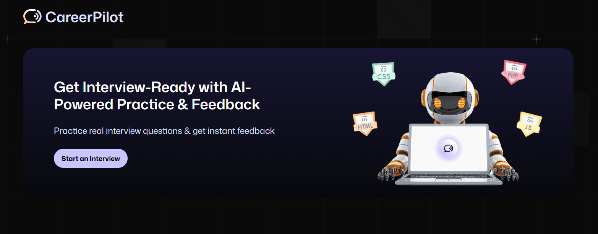

# 🤖 CareerPilot - AI Interview Platform



<div align="center">

**Get Interview-Ready with AI-Powered Practice & Feedback**

[](https://nextjs.org/)
[](https://www.typescriptlang.org/)
[](https://firebase.google.com/)
[](https://vapi.ai/)
[](https://tailwindcss.com/)

</div>

## 📋 Table of Contents

- [About the Project](#about-the-project)
- [Key Features](#key-features)
- [Tech Stack](#tech-stack)
- [Getting Started](#getting-started)
- [Project Structure](#project-structure)
- [API Routes](#api-routes)
- [Environment Variables](#environment-variables)
- [Contributing](#contributing)
- [License](#license)

## 🚀 About the Project

**CareerPilot** is an advanced AI-powered interview preparation platform that revolutionizes how job seekers practice and improve their interview skills. Built with cutting-edge technologies, it provides realistic mock interviews with instant, detailed feedback to help candidates excel in their job search.

### 🎯 Project Scope

CareerPilot addresses the critical gap in interview preparation by offering:

- **Personalized AI Interviews**: Tailored questions based on role, experience level, and technology stack
- **Real-time Voice Interaction**: Natural conversation flow using advanced voice AI
- **Comprehensive Feedback**: Detailed analysis of communication skills, technical knowledge, and areas for improvement
- **Progress Tracking**: Monitor improvement over time with detailed analytics
- **Multi-role Support**: Covers various technical roles and skill levels

### 🌟 Importance & Impact

In today's competitive job market, interview preparation is crucial for career success. CareerPilot democratizes access to high-quality interview practice by:

- **Reducing Interview Anxiety**: Safe environment to practice without judgment
- **Improving Success Rates**: Data-driven feedback helps identify and address weaknesses
- **Cost-Effective Solution**: Accessible alternative to expensive interview coaching
- **24/7 Availability**: Practice anytime, anywhere at your own pace
- **Standardized Assessment**: Consistent evaluation criteria across all interviews

## ✨ Key Features

### 🎤 AI-Powered Voice Interviews

- Real-time voice conversation with AI interviewer
- Natural language processing for realistic interactions
- Speech-to-text transcription for accurate analysis

### 📊 Intelligent Feedback System

- **Comprehensive Scoring**: Technical skills, communication, problem-solving
- **Detailed Analysis**: Strengths, weaknesses, and improvement suggestions
- **Category-wise Evaluation**: Breakdown by different skill areas
- **Actionable Insights**: Specific recommendations for growth

### 🎯 Customizable Interview Experience

- **Role-specific Questions**: Frontend, Backend, Full-stack, DevOps, etc.
- **Technology Stack Focus**: React, Node.js, Python, AWS, and 40+ technologies
- **Difficulty Levels**: Junior, Mid-level, Senior positions
- **Interview Types**: Technical, behavioral, system design

### 📈 Progress Tracking

- Interview history and performance trends
- Score improvements over time
- Areas of consistent strength/weakness identification

### 🔐 Secure User Management

- Firebase Authentication integration
- User data protection and privacy
- Secure session management

## 🛠️ Tech Stack

### **Frontend**

- **Next.js 15.3.5** - React framework for production
- **TypeScript** - Type-safe JavaScript
- **Tailwind CSS 4.0** - Utility-first CSS framework
- **Radix UI** - Accessible component library
- **React Hook Form** - Performant forms with easy validation

### **Backend & Database**

- **Next.js API Routes** - Serverless API endpoints
- **Firebase Admin SDK** - Server-side Firebase operations
- **Firebase Firestore** - NoSQL database for scalable storage
- **Firebase Authentication** - User management and security

### **AI & Voice Technology**

- **Vapi AI** - Advanced voice AI for natural conversations
- **Google AI SDK** - Gemini model for intelligent feedback generation
- **Structured Output Generation** - Consistent feedback formatting

### **Development Tools**

- **ESLint** - Code linting and quality assurance
- **PostCSS** - CSS processing and optimization
- **Day.js** - Modern date manipulation library

### **UI/UX**

- **Lucide React** - Beautiful icon library
- **Sonner** - Toast notifications
- **Custom Design System** - Consistent visual language
- **Responsive Design** - Mobile-first approach

## 🚀 Getting Started

### Prerequisites

- Node.js 18+ installed
- npm or yarn package manager
- Firebase project setup
- Vapi AI account and API keys

### Installation

1. **Clone the repository**

   ```bash
   git clone https://github.com/fernandonpa/ai_interview_platform.git
   cd ai_interview_platform
   ```

2. **Install dependencies**

   ```bash
   npm install
   # or
   yarn install
   ```

3. **Environment Setup**
   Create a `.env.local` file in the root directory:

   ```env
   # Firebase Configuration
   NEXT_PUBLIC_FIREBASE_API_KEY=your_firebase_api_key
   NEXT_PUBLIC_FIREBASE_AUTH_DOMAIN=your_project.firebaseapp.com
   NEXT_PUBLIC_FIREBASE_PROJECT_ID=your_project_id
   NEXT_PUBLIC_FIREBASE_STORAGE_BUCKET=your_project.appspot.com
   NEXT_PUBLIC_FIREBASE_MESSAGING_SENDER_ID=your_sender_id
   NEXT_PUBLIC_FIREBASE_APP_ID=your_app_id

   # Firebase Admin
   FIREBASE_PRIVATE_KEY=your_private_key
   FIREBASE_CLIENT_EMAIL=your_client_email
   FIREBASE_PROJECT_ID=your_project_id

   # Vapi AI Configuration
   NEXT_PUBLIC_VAPI_PUBLIC_KEY=your_vapi_public_key
   VAPI_PRIVATE_KEY=your_vapi_private_key
   NEXT_PUBLIC_VAPI_WORKFLOW_ID=your_workflow_id

   # Google AI
   GOOGLE_GENERATIVE_AI_API_KEY=your_google_ai_key
   ```

4. **Run the development server**

   ```bash
   npm run dev
   # or
   yarn dev
   ```

5. **Open your browser**
   Navigate to [http://localhost:3000](http://localhost:3000)

## 📁 Project Structure

```
ai_interview_platform/
├── app/                          # Next.js 13+ App Router
│   ├── (auth)/                   # Authentication routes
│   │   ├── sign-in/             # Sign in page
│   │   └── sign-up/             # Sign up page
│   ├── (root)/                   # Main application routes
│   │   ├── interview/           # Interview-related pages
│   │   │   ├── [id]/           # Dynamic interview pages
│   │   │   │   └── feedback/   # Feedback display
│   │   │   └── page.tsx        # Interview setup
│   │   └── page.tsx            # Dashboard/Home
│   ├── api/                     # API routes
│   │   └── vapi/               # Vapi integration endpoints
│   ├── globals.css             # Global styles
│   └── layout.tsx              # Root layout
├── components/                   # Reusable React components
│   ├── ui/                     # UI component library
│   ├── Agent.tsx               # AI Interview agent
│   ├── AuthForm.tsx            # Authentication forms
│   ├── InterviewCard.tsx       # Interview display card
│   └── ...                     # Other components
├── constants/                    # Application constants
├── firebase/                     # Firebase configuration
├── lib/                         # Utility libraries
│   ├── actions/                # Server actions
│   ├── utils.ts                # Helper functions
│   └── vapi.sdk.ts             # Vapi SDK integration
├── public/                      # Static assets
├── types/                       # TypeScript type definitions
└── package.json                # Dependencies and scripts
```

## 🔌 API Routes

### `/api/vapi/generate`

- **Method**: POST
- **Purpose**: Generate interview questions and setup
- **Authentication**: Required
- **Parameters**: Role, level, tech stack, question count

## 🔐 Environment Variables

The application requires several environment variables for proper functionality:

| Variable                       | Description                   | Required |
| ------------------------------ | ----------------------------- | -------- |
| `NEXT_PUBLIC_FIREBASE_*`       | Firebase client configuration | ✅       |
| `FIREBASE_*`                   | Firebase admin configuration  | ✅       |
| `NEXT_PUBLIC_VAPI_*`           | Vapi AI client keys           | ✅       |
| `VAPI_PRIVATE_KEY`             | Vapi AI server key            | ✅       |
| `GOOGLE_GENERATIVE_AI_API_KEY` | Google AI API key             | ✅       |

## 🤝 Contributing

We welcome contributions to CareerPilot! Here's how you can help:

1. **Fork the repository**
2. **Create a feature branch**
   ```bash
   git checkout -b feature/amazing-feature
   ```
3. **Make your changes**
4. **Commit your changes**
   ```bash
   git commit -m 'Add some amazing feature'
   ```
5. **Push to the branch**
   ```bash
   git push origin feature/amazing-feature
   ```
6. **Open a Pull Request**

### Development Guidelines

- Follow TypeScript best practices
- Maintain consistent code formatting with ESLint
- Write meaningful commit messages
- Test your changes thoroughly
- Update documentation as needed

## 📜 License

This project is licensed under the MIT License - see the [LICENSE](LICENSE) file for details.

## 🙏 Acknowledgments

- [Next.js](https://nextjs.org/) for the amazing React framework
- [Vapi AI](https://vapi.ai/) for voice AI capabilities
- [Firebase](https://firebase.google.com/) for backend services
- [Tailwind CSS](https://tailwindcss.com/) for utility-first styling
- [Radix UI](https://www.radix-ui.com/) for accessible components

---

<div align="center">

**Built with ❤️ for better interview preparation**

[🌟 Star this project](https://github.com/your-username/ai_interview_platform) | [🐛 Report Bug](https://github.com/your-username/ai_interview_platform/issues) | [💡 Request Feature](https://github.com/your-username/ai_interview_platform/issues)

</div>
